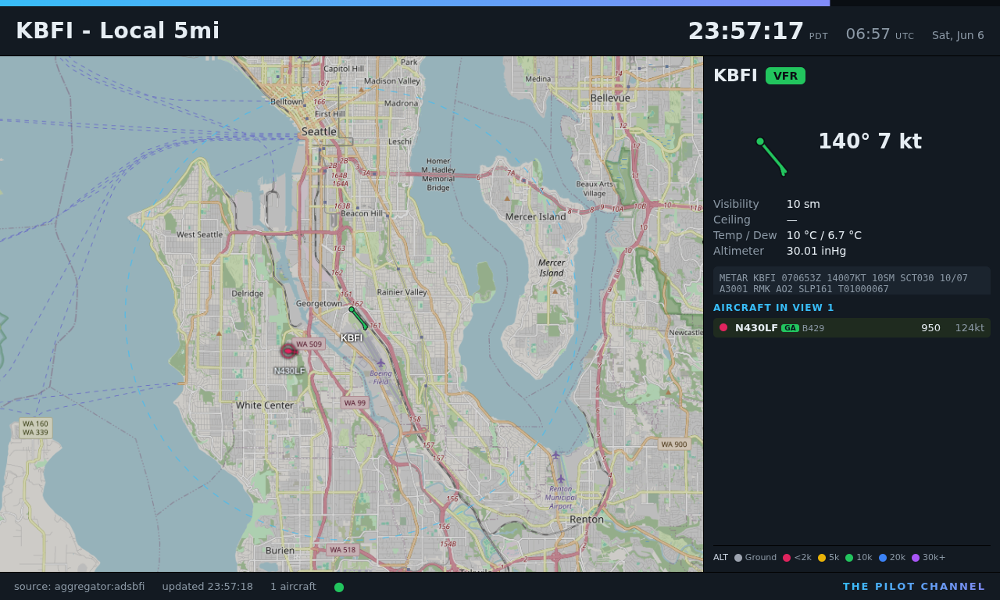
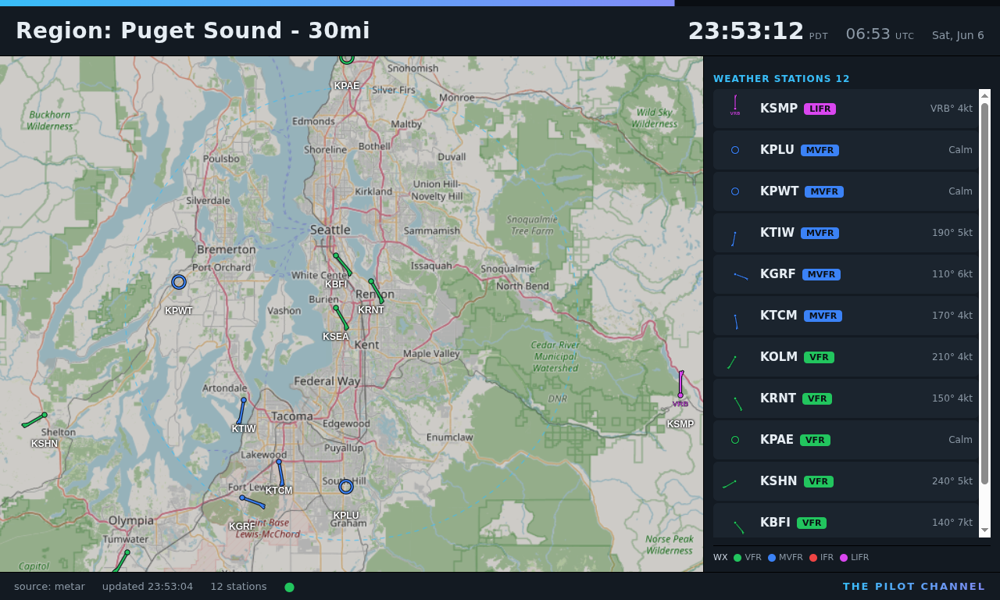
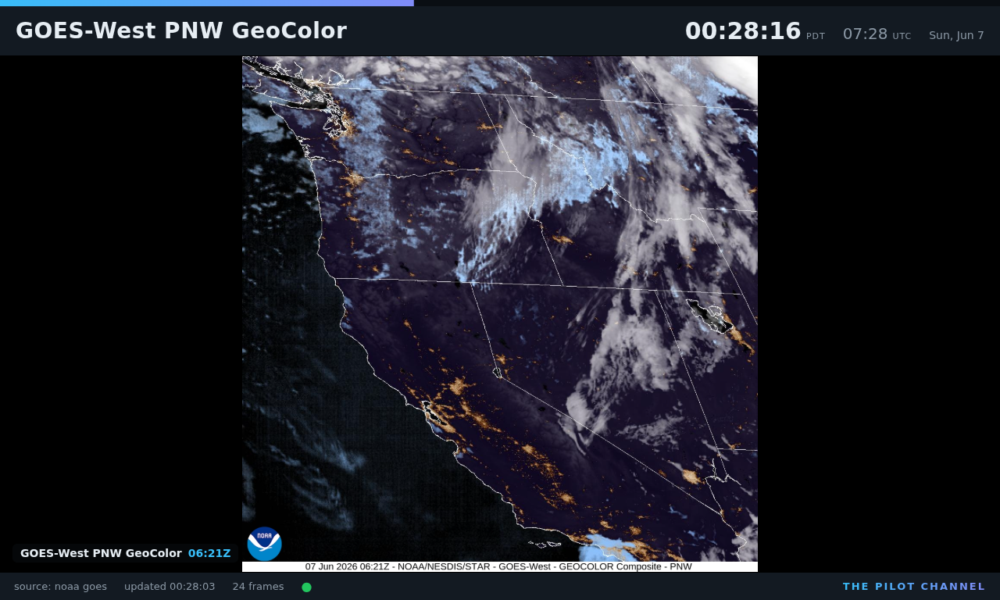
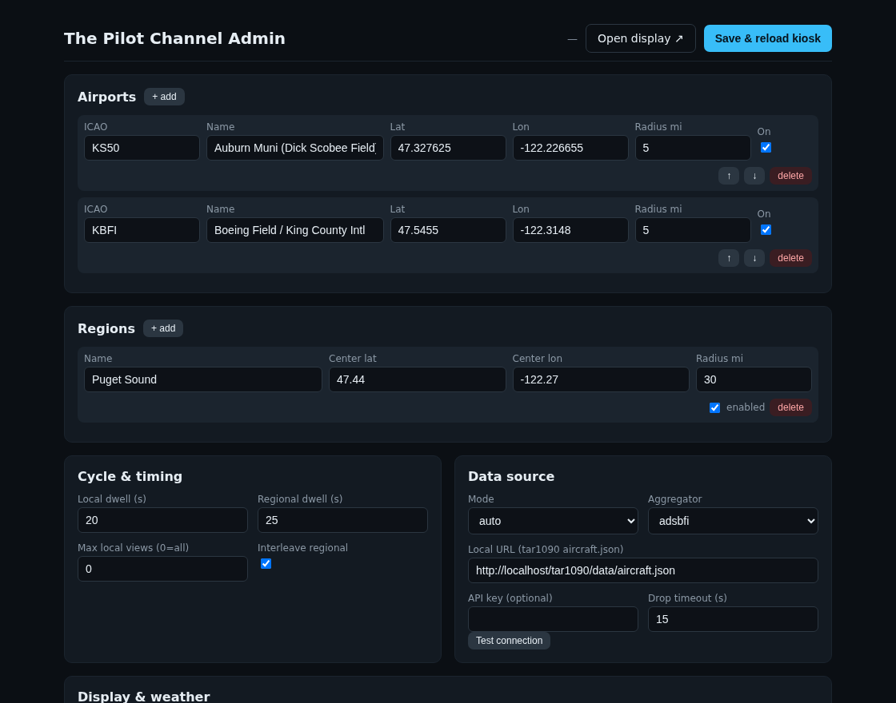

# The Pilot Channel

A wall-mounted information display for an airplane hangar. It runs on a Raspberry Pi 4
and drives an HDMI TV. The screen cycles through a set of views on a timer, showing live
ADS-B air traffic, METAR weather, flight-category wind barbs, and local and UTC clocks.

The app stack runs in Docker. The on-screen browser (the kiosk) runs natively on the Pi
because it needs direct access to the GPU and HDMI output.

## Screenshots

Local airport view (live traffic, METAR, and wind barb):



Regional weather view (wind barbs for every reporting airport in view):



Satellite loop view (animated NOAA GOES imagery):



Admin page (remote configuration):



## Views

The display cycles through views automatically. A bar at the top of the screen drains
left to right to show the time remaining on the current view.

Local view (one per airport):

- Centered on an airport with a configurable radius (for example 5 miles).
- Live aircraft drawn as type-based silhouettes (airliner, light single, helicopter,
  turboprop, business jet, glider, balloon, military), colored by altitude band and
  rotated to track. Each aircraft is labeled with its callsign or registration.
- On-ground aircraft are included.
- Side panel shows the airport METAR (decoded plus the raw line) with a large wind barb,
  and a live list of every aircraft in view.
- The aircraft list is ordered by importance: general aviation first, then lowest
  altitude first. Parked aircraft sort to the bottom of each group.

Regional view (weather overview):

- Focused on weather, with no aircraft.
- Wind barbs for every reporting airport that is visible on the map. Stations are queried
  by the map's visible bounds, so this is not limited to the airports in the config file.
- Side panel lists the stations sorted worst conditions first (LIFR, IFR, MVFR, VFR), each
  with its flight category and wind.

Satellite loop view (optional):

- A fullscreen animated NOAA GOES satellite loop (for example GOES-West, Pacific
  Northwest sector, GeoColor band).
- Frames come from the NOAA STAR image CDN. The backend reads the CDN listing and returns
  the most recent frames; the frontend preloads them and plays the loop, holding briefly on
  the newest frame.
- Enable, disable, and configure it (satellite, sector, band, size, frame count, dwell)
  from the admin page.

## Features

- Pluggable ADS-B traffic source: a local receiver, a free public aggregator, or
  automatic local-first with aggregator fallback.
- METAR weather from the US National Weather Service Aviation Weather Center. No API key.
- Flight category uses the API value when present and otherwise derives it from FAA AIM
  7-1-7 thresholds. Colors: VFR green, MVFR blue, IFR red, LIFR magenta. White when the
  category is unknown.
- Wind barbs use standard notation (5 kt half barb, 10 kt full barb, 50 kt pennant) with a
  station dot at the base, a calm ring for no wind, and a VRB marker for variable wind.
- Aircraft type classification is driven by ICAO type designator and ADS-B emitter
  category, not callsign. A flight-school aircraft flying with an airline-style callsign is
  still classed as general aviation, and a privately registered airliner is still an
  airliner.
- Aircraft reporting a negative altitude are treated as invalid and dropped.
- Remote configuration from a phone or laptop at `/admin`. Saving applies immediately and
  reloads the display.

## Hardware and operating system

- Raspberry Pi 4 (tested on the 4 GB model).
- microSD card, 8 GB or larger.
- Raspberry Pi OS or Debian 13 (Trixie), 64-bit.
- Display connected to HDMI0.
- Network access. The Pi needs the internet for map tiles, weather, and the public
  aggregator. A local receiver can be on the LAN instead of the public aggregator.

## Architecture

```
+----------------------- Raspberry Pi 4 ------------------------+
|  Docker (docker compose)                                      |
|    app container                                              |
|      FastAPI backend: REST + SSE                              |
|        source adapters, cache, rate limit, weather poller     |
|      built frontend (Vite) served as static files             |
|    data/config.yaml  (bind mounted at /data)                  |
|                                                               |
|  Native host (systemd autologin on tty1)                      |
|    cage + Chromium in kiosk mode  ->  http://localhost:8000   |
+---------------------------------------------------------------+

   phone or laptop  ->  http://<pi-ip>:8000/admin
```

The backend keeps one cached snapshot per active view and refreshes it in the background,
so the browser poll never blocks on a slow upstream call. Aircraft positions update once
per second and the browser tweens between positions with a CSS transform transition, which
keeps motion smooth without overshooting.

## Setup

There are two ways to run The Pilot Channel:

- Quick start: run just the app stack in Docker on any machine to try it in a browser.
- Full kiosk: provision a Raspberry Pi so it boots straight into the full-screen display
  on a connected TV. This is the intended deployment.

### Prerequisites

- A Raspberry Pi 4 and an HDMI display for the full kiosk. The quick start runs on any
  64-bit Linux machine with Docker.
- Git, to clone this repository.
- Internet access. The display fetches map tiles, weather, satellite imagery, and (unless
  you run a local receiver) public ADS-B traffic.

The kiosk installer (`deploy/install.sh`) installs Docker for you. For the quick start you
install Docker yourself, as shown below.

### Quick start (Docker only)

Use this to evaluate the app on a laptop or any Linux box, or to run the backend on a Pi
without the on-screen kiosk.

1. Install Docker Engine and the compose plugin. On Debian or Raspberry Pi OS:

```bash
curl -fsSL https://get.docker.com | sudo sh
sudo usermod -aG docker "$USER"   # then log out and back in so the group applies
```

2. Clone the repo and bring up the stack:

```bash
git clone https://github.com/juchong/ThePilotChannel.git
cd ThePilotChannel
docker compose up -d --build
```

3. Open the display at `http://<host-ip>:8000` and the admin page at
   `http://<host-ip>:8000/admin`.

The container is set to `restart: unless-stopped`, so once the Docker service is enabled on
boot the stack comes back automatically after a reboot.

### Full kiosk on a Raspberry Pi

This is the intended deployment: the Pi boots into a full-screen browser on the TV with no
desktop. The app stack runs in Docker; the on-screen browser (cage + Chromium) runs
natively because it needs direct GPU and HDMI access.

1. Flash the OS. Use Raspberry Pi Imager to write Raspberry Pi OS Lite (64-bit) to the SD
   card. In the Imager settings (the gear icon), set the hostname, enable SSH, create the
   user, and configure Wi-Fi if you are not on Ethernet. The default user `pi` is fine.

2. Boot the Pi, connect over SSH (or attach a keyboard), and update the system:

```bash
sudo apt-get update && sudo apt-get full-upgrade -y
```

3. Install Git and clone the repository:

```bash
sudo apt-get install -y git
git clone https://github.com/juchong/ThePilotChannel.git
cd ThePilotChannel
```

4. Run the installer. It installs the kiosk packages (cage, Chromium, wlrctl, seatd),
   installs Docker if it is missing, enables the GPU overlay, configures autologin on tty1,
   installs the kiosk launcher, and brings up the Docker stack:

```bash
sudo bash deploy/install.sh
```

5. Reboot:

```bash
sudo reboot
```

After the reboot the Pi logs in automatically on tty1 and launches the kiosk, which waits
for the backend to become healthy and then opens the display full screen. To start the
kiosk without rebooting, run `sudo systemctl restart getty@tty1`.

The kiosk keeps its Chromium profile, disk cache, and log on a RAM disk (`/dev/shm`) to
minimize SD card wear; these are recreated on every boot. The kiosk log is at
`/dev/shm/hangar-kiosk/hangar-kiosk.log`.

### Verify the install

- Backend health: `curl http://localhost:8000/healthz` returns JSON with `"ok": true`.
- Containers: `docker compose ps` shows the `hangar-display` service as healthy.
- On the Pi, the TV shows the display cycling through views. The mouse pointer is parked in
  a screen corner so it stays out of view.

Then configure airports, regions, and data sources from `http://<pi-ip>:8000/admin` or by
editing `data/config.yaml` (see Configuration below).

## Configuration

All settings live in `data/config.yaml`. Edit it by hand or from `/admin`. Saving from the
admin page writes the file and pushes a reload to the display. Airports and regions are
lists of any length.

```yaml
airports:
  - icao: KS50            # ICAO or FAA identifier
    name: Auburn Muni
    lat: 47.327625
    lon: -122.226655
    local_radius_mi: 5.0  # local view radius in miles
    enabled: true

regions:
  - name: Puget Sound
    center_lat: 47.44
    center_lon: -122.27
    radius_mi: 30.0       # used to frame the map; barbs cover what is visible
    enabled: true

cycle:
  local_dwell_s: 20       # seconds on each local view
  regional_dwell_s: 25    # seconds on each regional view
  order: []               # optional explicit view order by id
  max_local_views: 0      # 0 means no cap
  interleave_regional: true  # show a regional view between local views

data_source:
  mode: auto              # local | aggregator | auto
  local_url: "http://localhost/tar1090/data/aircraft.json"
  aggregator: adsbfi      # adsbfi | adsblol | airplaneslive
  api_key: ""             # optional, used by airplanes.live Pro
  drop_timeout_s: 15      # remove an aircraft after this many seconds unseen

display:
  units: imperial         # imperial | metric
  timezone: America/Los_Angeles
  resolution: "1920x1080"
  basemap: raster_osm     # raster_osm | vector
  tile_url: ""            # vector style URL or raster tile template override
  tile_api_key: ""

weather:
  refresh_s: 300          # METAR refresh interval
  stale_after_s: 4500     # mark a report stale after this age

satellite:
  enabled: true           # add the satellite loop to the cycle
  sat: G18                # G16 (East), G18 (West), G19
  sector: pnw             # NOAA STAR sector code
  band: GEOCOLOR
  frames: 24              # number of frames in the loop
  size: 1200x1200         # 300x300 | 600x600 | 1200x1200 | 2400x2400
  dwell_s: 25
  label: GOES-West PNW GeoColor
```

## Data sources

Traffic, set by `data_source.mode`:

- `local`: a tar1090, readsb, or dump1090 `aircraft.json` reachable from the Pi.
- `aggregator`: a free public API. Options are adsb.fi, adsb.lol, and airplanes.live. These
  are rate limited to about 1 request per second.
- `auto`: try the local receiver first and fall back to the aggregator.

The backend makes one upstream request per active view and shares the result across all
clients, so the rate limit is respected no matter how many displays connect.

Weather: the aviationweather.gov Data API. Per-airport METARs use the `ids` query, and the
regional view uses a bounding-box query to find every reporting station on screen.

## HTTP API

- `GET /healthz` liveness and source status.
- `GET /api/config` and `PUT /api/config` read and write the full config.
- `GET /api/views` resolved, ordered list of views.
- `GET /api/traffic?view=<id>` normalized aircraft snapshot for a view.
- `GET /api/weather?ids=<csv>` normalized METARs for specific airports.
- `GET /api/weather/bbox?min_lat=&min_lon=&max_lat=&max_lon=` METARs in a box.
- `GET /api/weather/area?lat=&lon=&radius_nm=` METARs within a radius.
- `GET /api/satellite?sat=&sector=&band=&size=&frames=` recent GOES frame URLs.
- `GET /api/status` current source and health.
- `POST /api/test-source` check connectivity for a candidate source.
- `GET /api/stream` server-sent events: `config_changed`, `weather_updated`.

## Project layout

```
backend/
  app/
    main.py        FastAPI app, routes, SSE, static file serving
    config.py      config model, load and save
    manager.py     sources, cache, rate limit, weather, background refresh
    views.py       build the ordered view list from config
    weather.py     METAR fetch, decode, flight category
    satellite.py   NOAA GOES frame-list fetcher
    geo.py         distance and bounding-box helpers
    sources/
      base.py      source interface and aircraft normalizer
      local.py     local receiver source
      aggregator.py  adsb.fi, adsb.lol, airplanes.live
  requirements.txt
frontend/
  src/
    index.html, main.js      the display
    admin.html, admin.js     the admin page
    styles.css, admin.css
    lib/
      api.js        REST client and SSE
      map.js        MapLibre map, aircraft and barb markers
      aircraft.js   aircraft store, sorting, filtering
      windbarb.js   wind barb SVG
      shapes.js     silhouettes and type classification
      geo.js        client geo helpers
  package.json, vite.config.js
data/config.yaml
deploy/
  install.sh           provision the kiosk and bring up Docker
  kiosk-launch.sh      launch cage and Chromium
  getty-autologin.conf tty1 autologin drop-in
Dockerfile
docker-compose.yml
```

## Development

Backend:

```bash
cd backend
python3 -m venv .venv && . .venv/bin/activate
pip install -r requirements.txt
HANGAR_CONFIG=../data/config.yaml HANGAR_STATIC=../frontend/dist \
  uvicorn app.main:app --reload --port 8000
```

Frontend (Vite dev server with an API proxy to the backend):

```bash
cd frontend
npm install
npm run dev
```

The dev server serves the display at `/` and the admin page at `/admin.html`.

## Operations

- Apply a config change: edit in `/admin` and save, or edit `data/config.yaml` and run
  `docker compose restart`.
- Update the app after code changes: `docker compose up -d --build`.
- Reload the kiosk without rebooting: stop the cage process and let autologin restart it,
  for example `pkill -x cage`.
- Kiosk log: `/dev/shm/hangar-kiosk/hangar-kiosk.log`. Backend logs: `docker compose logs -f`.

## Troubleshooting

- The TV stays blank or the kiosk never appears. Check the kiosk log at
  `/dev/shm/hangar-kiosk/hangar-kiosk.log`. Make sure the GPU overlay is enabled
  (`dtoverlay=vc4-kms-v3d` in `/boot/firmware/config.txt`) and that you rebooted after
  running the installer. The launcher waits for the backend to be healthy before opening
  the browser, so confirm the stack is up with `docker compose ps`.
- The kiosk log shows `Unable to create the wlroots backend`. cage must run on the physical
  console (tty1) and must not see a `WAYLAND_DISPLAY` in its environment, otherwise it tries
  to run nested as a Wayland client. Do not export `WAYLAND_DISPLAY` in the login shell, and
  launch the kiosk only from tty1.
- `docker: permission denied` when running compose. Your user is not yet in the `docker`
  group. Log out and back in after the installer adds you, or prefix the command with
  `sudo`.
- The map is blank or tiles do not load. The display needs internet for map tiles. Verify
  connectivity, or host tiles locally and set `display.tile_url` (see Notes).
- No aircraft appear. Check `http://<pi-ip>:8000/api/status` for the active source and any
  error. In `local` or `auto` mode confirm `data_source.local_url` is reachable from the Pi;
  in `aggregator` mode remember the public APIs are rate limited to about 1 request/second.
- No weather or wind barbs. The backend reads aviationweather.gov with no API key; confirm
  the Pi can reach it and that your airport identifiers are valid.

## Notes

- The frontend is plain JavaScript built with Vite. Modules are split by responsibility.
- Aircraft are colored by altitude band so flight-category colors stay reserved for wind
  barbs and METAR text. The two color systems never appear on the same kind of marker.
- The default basemap is key-free raster OpenStreetMap. To use vector tiles, set
  `display.basemap` to `vector` and provide a style URL in `display.tile_url`.
- Map tiles and glyphs are fetched from public services, so the display needs internet. For
  an offline hangar, host tiles and glyphs locally and point `display.tile_url` at them.
```
