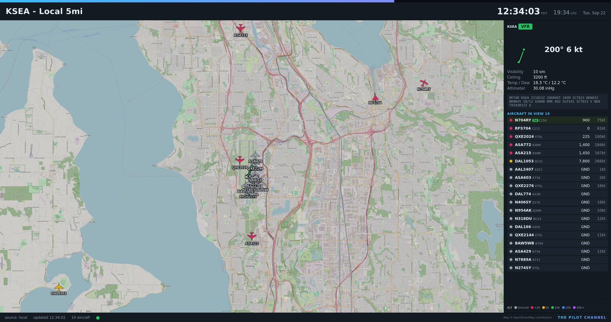
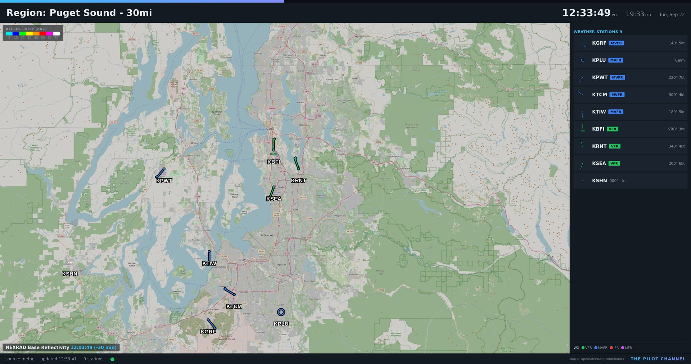
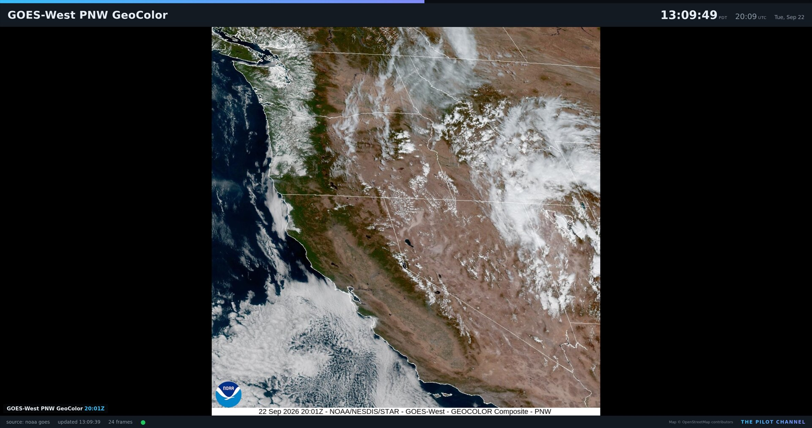
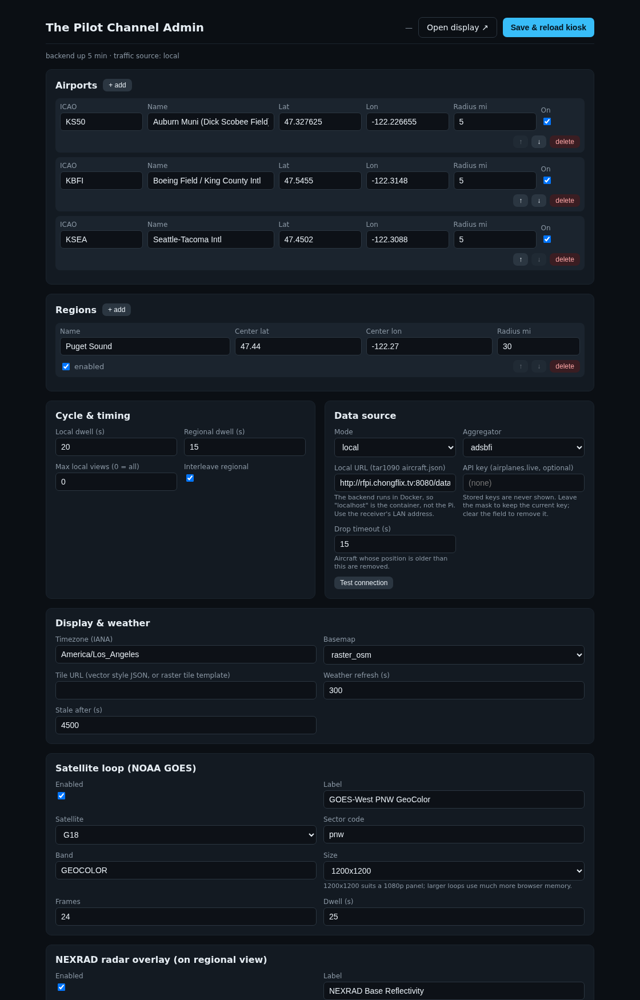

# The Pilot Channel

A wall-mounted information display for an airplane hangar. A Raspberry Pi 4 drives an
HDMI TV that cycles through live ADS-B air traffic around your airports, METAR weather with
flight-category wind barbs, an animated NEXRAD precipitation radar loop, a NOAA GOES
satellite loop, and local and UTC clocks. Everything is configured from a phone or laptop
on the hangar Wi-Fi.

Local airport view (live traffic, METAR, and wind barb):



Regional weather view (wind barbs for every reporting airport in view, over the radar loop):



Satellite loop view (animated NOAA GOES imagery):



Admin page (remote configuration):



## What it shows

The display cycles through views automatically. A bar across the top drains to show the
time left on the current view.

- **Local view, one per airport.** Centered on the airport with a radius you choose (5
  miles is typical). Live aircraft are drawn as type-based silhouettes (airliner, light
  single, helicopter, turboprop, business jet, glider, balloon, military), colored by
  altitude and rotated to their track, each labeled with its callsign or registration.
  Aircraft on the ground are included. The side panel shows the airport's METAR, decoded
  and raw, with a large wind barb, and a list of every aircraft in view with general
  aviation first.
- **Regional view.** Weather only: a wind barb for every airport reporting a METAR inside
  the map, colored by flight category (VFR green, MVFR blue, IFR red, LIFR magenta), over
  an animated NEXRAD base-reflectivity radar loop. The side panel lists the stations, worst
  conditions first.
- **Satellite loop (optional).** A full-screen NOAA GOES animation for your part of the
  country, for example GOES-West, Pacific Northwest sector, GeoColor.

No API keys are needed. Weather comes from the US National Weather Service Aviation Weather
Center, radar from the Iowa Environmental Mesonet, satellite imagery from NOAA STAR, and map
tiles from OpenStreetMap. Traffic comes from your own ADS-B receiver if you have one, or
from a free public aggregator (adsb.fi, adsb.lol, or airplanes.live).

## What you need

- A Raspberry Pi 4 (the 4 GB model is what this was built on) with a microSD card of 8 GB
  or more, a power supply, and an HDMI cable to the TV (use the HDMI0 port).
- Raspberry Pi OS Lite, 64-bit (the current Debian 13 based release).
- Network access, wired or Wi-Fi. The Pi needs the internet for map tiles, weather, radar,
  and satellite imagery, and for traffic unless you run your own receiver.
- Optional: a tar1090, readsb, or dump1090 receiver on your network for local traffic with
  no rate limits.
- A phone or laptop on the same network to configure it.

## Install on the Raspberry Pi

One script turns a freshly flashed Pi into the kiosk. It is safe to run again at any time,
and `--check` reports what is and is not set up without changing anything.

1. **Flash the OS.** Use Raspberry Pi Imager to write Raspberry Pi OS Lite (64-bit). In the
   Imager settings (gear icon) set a hostname, enable SSH, create your user, and enter your
   Wi-Fi details if you are not using Ethernet.

2. **Boot the Pi and connect over SSH** (or plug in a keyboard) as the user you created.

3. **Run the bootstrap.** Pick an admin password so that only you can change the display
   (leave the option off if you really want it open to everyone on your network):

   ```bash
   curl -fsSL https://raw.githubusercontent.com/juchong/ThePilotChannel/main/deploy/bootstrap.sh \
     | bash -s -- --admin-password 'choose-a-password' --reboot
   ```

   It takes ten to twenty minutes on a Pi 4, most of it the system update and the first
   build of the app. With `--reboot` the Pi restarts by itself when done; otherwise run
   `sudo reboot`. The TV shows a "The Pilot Channel" holding screen while the app starts,
   then the display.

4. **Check that it worked.** From your phone or laptop open `http://<pi-ip>:8000/admin`
   (the bootstrap prints the address). On the Pi, `~/ThePilotChannel/deploy/bootstrap.sh --check`
   should report every step as `[ok]`.

What the bootstrap does, in order, each step only if it is not already done:

- Updates the system (`apt-get full-upgrade`; skip with `--no-upgrade`).
- Installs the kiosk browser and its compositor (`chromium`, `cage`, `wlrctl`, `seatd`),
  `grim` for screenshots, `git`, `curl`, and the two packages rootless Docker needs
  (`uidmap`, `dbus-user-session`). It also installs ImageMagick and a small wrapper so
  `grim` can write `jpeg`, `webp`, `avif`, and `gif` screenshots (the stock Debian build
  only writes `png`); `sudo rm /usr/local/bin/grim` reverts to the stock grim.
- Clones this repository to `~/ThePilotChannel` (or uses the clone it is run from).
- Installs Docker CE with Docker's own installer, then switches it to rootless mode for
  your user: the daemon runs as you, not root, starts at boot without a login, and the
  root-level daemon is disabled so it does not waste memory.
- Enables the GPU overlay (`dtoverlay=vc4-kms-v3d`, `max_framebuffers=2`) the kiosk needs.
- Enables `seatd` and puts your user in the `video`, `render`, and `input` groups so the
  kiosk can drive the HDMI output directly.
- Configures automatic login on the TV console (tty1) and adds a hook to your login shell
  that starts the kiosk there and nowhere else (not over SSH).
- Turns Wi-Fi power saving off, which otherwise drops connections on an unattended Pi.
- Writes the admin password to `.env` if you gave one.
- Builds the app image and starts it, waiting until it answers.

Options: `--check`, `--dry-run`, `--no-upgrade`, `--no-start`, `--reboot`,
`--admin-password PW`, `--repo-dir DIR`. Run it with `--help` for the same list.

The kiosk runs natively (cage plus Chromium) rather than in Docker because it needs the
GPU and HDMI output. It keeps Chromium's profile, cache, and its log on a RAM disk
(`/dev/shm/hangar-kiosk`) to spare the SD card.

## Try it without a Pi

You can run the app on any 64-bit Linux machine with Docker and look at it in a browser.
This is handy for setting up airports before the Pi is ready.

```bash
curl -fsSL https://get.docker.com | sudo sh
sudo usermod -aG docker "$USER"   # log out and back in afterwards
git clone https://github.com/juchong/ThePilotChannel.git
cd ThePilotChannel
docker compose up -d --build
```

Then open `http://<host-ip>:8000` for the display and `http://<host-ip>:8000/admin` for the
settings.

## Set up your hangar

Open `http://<pi-ip>:8000/admin` (it asks for the password if you set one). Every field is
checked when you save, mistakes are highlighted, and the TV reloads with the new settings.

**Airports.** One row per airport you want a local view for: the ICAO identifier (for
example `KSEA`; for US fields without one use the FAA identifier such as `S50`), a name, the
latitude and longitude of the field, and the radius in miles. Use the arrows to set the
order they appear in. Airports without a weather station show "no weather" on their local
view but still show traffic.

**Regions.** A wider view for the weather overview: a center point and a radius. Wind
barbs appear for every airport reporting weather inside the map, not just the ones you
listed. One region is usually enough; with more, they are interleaved between the local
views.

**Cycle and timing.** How many seconds each local and regional view stays on screen.

**Data source.** Where aircraft positions come from:

- `aggregator`: a free public feed. Pick adsb.fi, adsb.lol, or airplanes.live. Coverage
  depends on volunteers' receivers near your airport, and updates arrive about once a
  second.
- `local`: your own tar1090, readsb, or dump1090 receiver. Enter the URL of its
  `aircraft.json`, for example `http://192.168.1.20:8080/data/aircraft.json`. Use the
  receiver's LAN address even if it runs on the Pi itself, because the app runs inside a
  container where `localhost` means the container.
- `auto`: use the local receiver and fall back to the aggregator when it is unreachable.

Press **Test connection** to check the source before saving; it reports how many aircraft
each source sees near your first airport.

**Display.** Your IANA timezone (for example `America/Denver`) for the clock. The map
uses OpenStreetMap tiles by default. The Pi keeps a copy of every tile your views need in
`data/tiles` (fetched once, refreshed every two weeks) and downloads them for new airports
and regions in the background after you save, so views switch without the map redrawing.
If you have your own tile server or a vector style URL from a map provider, enter it here.

**Weather.** How often METARs refresh and when to flag a report as stale.

**Satellite loop.** Choose the satellite (G16 is GOES-East, G18 is GOES-West), the sector,
and the band. Find your sector code on the NOAA STAR GOES image viewer: open your region's
page and use the short code from its address, for example `pnw` (Pacific Northwest),
`psw` (Pacific Southwest), `nr` (Northern Rockies), `sr` (Southern Rockies), `sp`
(Southern Plains), `umv` (Upper Mississippi Valley), `cgl` (Central Great Lakes), `ne`
(Northeast), `se` (Southeast). `GEOCOLOR` is the natural-color band most people want.
`1200x1200` frames suit a 1080p TV.

**Radar overlay.** Shown on the regional view. Ten frames five minutes apart give a
45-minute loop; the loop can reach back at most 55 minutes.

**Screen.** Buttons to black out and restore the picture, the same thing an automation
can do (see below).

### Editing the file directly

Everything the admin page sets lives in `data/config.yaml` on the Pi. You can edit it by
hand and run `docker compose restart` to apply. The previous three versions are kept as
`config.yaml.bak.1` to `.3` every time it is saved, and if the file is ever unreadable the
display still starts, using the newest good backup, and the admin page shows a banner
explaining what is wrong.

```yaml
airports:
  - icao: KSEA
    name: Seattle-Tacoma Intl
    lat: 47.4502
    lon: -122.3088
    local_radius_mi: 5.0
    enabled: true

regions:
  - name: Puget Sound
    center_lat: 47.44
    center_lon: -122.27
    radius_mi: 30.0
    enabled: true

cycle:
  local_dwell_s: 20          # seconds on each local view
  regional_dwell_s: 15       # seconds on each regional view
  order: []                  # optional explicit order of view ids
  max_local_views: 0         # 0 means show every enabled airport
  interleave_regional: true  # put a regional view between local views

data_source:
  mode: auto                 # local | aggregator | auto
  local_url: http://192.168.1.20:8080/data/aircraft.json
  aggregator: adsbfi         # adsbfi | adsblol | airplaneslive
  api_key: ""                # airplanes.live Pro only; never shown again once saved
  drop_timeout_s: 15         # remove an aircraft whose position is older than this

display:
  timezone: America/Los_Angeles
  basemap: raster_osm        # raster_osm | vector
  tile_url: ""               # vector style URL, or a raster tile template override

weather:
  refresh_s: 300
  stale_after_s: 4500

satellite:
  enabled: true
  sat: G18                   # G16 (East), G18 (West), G19
  sector: pnw
  band: GEOCOLOR
  frames: 24
  size: 1200x1200            # 300x300 | 600x600 | 1200x1200 | 2400x2400
  dwell_s: 25
  label: GOES-West PNW GeoColor

radar:
  enabled: true
  label: NEXRAD Base Reflectivity
  frames: 10
  interval_min: 5            # multiple of 5; (frames - 1) x interval must be 55 or less
  opacity: 0.75
  product: n0q               # n0q (base reflectivity) | n0r
```

## Black out the screen from an automation

Home Assistant or any other system can black out the TV picture for a while and bring it
back, for example while a movie plays or when a doorbell rings. The display keeps running
underneath, so the picture returns instantly.

```bash
# black out for 30 seconds
curl -X POST -H 'content-type: application/json' \
  -d '{"seconds": 30, "reason": "doorbell"}' http://<pi-ip>:8000/api/display/blackout
```

```bash
# black out until told otherwise, then restore
curl -X POST http://<pi-ip>:8000/api/display/blackout
curl -X POST http://<pi-ip>:8000/api/display/restore
```

Add `-u any:<password>` to those calls if you set an admin password.

Home Assistant, in `configuration.yaml` (drop the `username` and `password` lines if there
is no admin password):

```yaml
rest_command:
  hangar_display_blackout:
    url: "http://<pi-ip>:8000/api/display/blackout"
    method: post
    content_type: "application/json"
    username: hass
    password: !secret hangar_admin_password
    payload: '{"seconds": {{ seconds | default(30) }}, "reason": "{{ reason | default("home assistant") }}"}'
  hangar_display_restore:
    url: "http://<pi-ip>:8000/api/display/restore"
    method: post
    username: hass
    password: !secret hangar_admin_password
```

Then in an automation:

```yaml
actions:
  - action: rest_command.hangar_display_blackout
    data:
      seconds: 20
      reason: doorbell
```

## Day to day

- **Change settings:** use the admin page. The TV reloads itself when you save.
- **Update to a new version:**

  ```bash
  cd ThePilotChannel && git pull && docker compose up -d --build
  ```

  The display notices the new version and reloads on its own.
- **Restart the display browser:** `pkill -x cage`. It comes straight back.
- **Reboot the Pi:** everything starts again automatically, including after a power cut.
- **Logs:** the app's log is `docker compose logs -f` (capped so it cannot fill the SD
  card); the kiosk browser's log is `/dev/shm/hangar-kiosk/hangar-kiosk.log`.
- **Undo a bad config change:** copy `data/config.yaml.bak.1` over `data/config.yaml` and
  run `docker compose restart`.
- **Map looks out of date or oddly cached:** delete the `data/tiles` folder; it is rebuilt
  automatically.

## Troubleshooting

- **The TV stays black or shows only the holding screen.** The app is not up yet or failed
  to start: run `docker compose ps` and `docker compose logs --tail=50` on the Pi. If the
  kiosk never appears at all, check `/dev/shm/hangar-kiosk/hangar-kiosk.log`, confirm
  `dtoverlay=vc4-kms-v3d` is in `/boot/firmware/config.txt`, and make sure you rebooted
  after the installer.
- **`Unable to create the wlroots backend` in the kiosk log.** The kiosk must start from
  the physical console (tty1) with no `WAYLAND_DISPLAY` in its environment. Do not export
  `WAYLAND_DISPLAY` in your login shell.
- **`docker` commands fail or say the daemon is not running.** Docker runs in rootless
  mode as your user: run `docker` commands as that user without `sudo`, and check
  `systemctl --user status docker`. `deploy/bootstrap.sh --check` reports what is wrong.
- **No aircraft.** Open `http://<pi-ip>:8000/api/status` or press Test connection on the
  admin page. For a local receiver, the URL must be its LAN address, not `localhost`.
- **No weather or wind barbs.** Check that the Pi can reach `aviationweather.gov` and that
  the identifier is right; some small fields have no weather station.
- **Map tiles do not load.** The Pi cannot reach OpenStreetMap. Check connectivity; tiles
  already in `data/tiles` keep working meanwhile. Or point `tile_url` at your own tile
  server.
- **A red banner on the admin page about `config.yaml`.** The file could not be read; the
  display is running with a backup or defaults. Fix the file by hand, or save from the admin
  page to write a fresh one (the broken file is kept as `config.yaml.bak.1`).
- **The footer dot is amber or red.** Amber means the last traffic snapshot is more than
  ten seconds old; red means the source is failing. Hover over it in a browser, or check
  `/api/status`, for the reason.

## For developers and AI agents

Architecture, code conventions, invariants, and the build, test, and verify workflow are in
[AGENTS.md](AGENTS.md).
